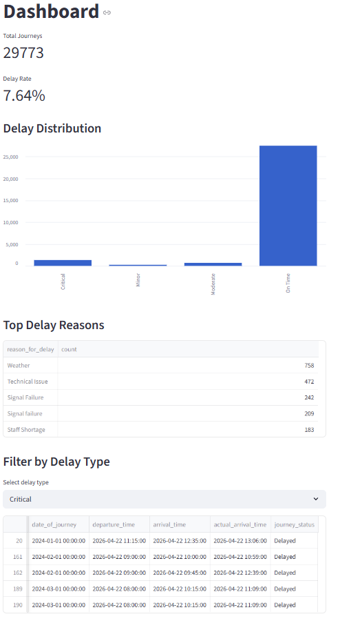

# 🚄 UK Rail Delay Monitoring & Alerting System


## 📌 Overview

An end-to-end **data engineering pipeline** designed to monitor UK rail operations, detect delays, and surface operational risks through automated metrics and alerting.

The system ingests raw journey data, transforms it into structured insights, and provides both programmatic outputs and an interactive dashboard for analysis.

---

## 🎯 Problem

Rail networks are critical infrastructure where delays and disruptions can significantly impact operations and passenger experience.

This project simulates a real-world operational scenario:
- Detecting delays across journeys  
- Identifying high-risk patterns  
- Providing visibility into causes of disruption  
- Supporting operational decision-making  

---

## 🏗️ Architecture

```
Raw Data → Cleaning → Transformation → Storage → Metrics → Alerts → Dashboard
```

---

## ⚙️ Pipeline Stages

### 📥 Ingestion
- Loads raw journey data from CSV files  

### 🧹 Data Cleaning
- Standardises schema (column names, formats)  
- Handles missing and inconsistent values  
- Converts timestamps to usable datetime formats  

### 🔄 Transformation
- Calculates expected vs actual journey durations  
- Computes delay in minutes  
- Classifies journeys:
  - On Time  
  - Minor  
  - Moderate  
  - Critical  
- Extracts temporal features (hour, day)

### 🗄️ Storage
- Stores processed data in a **SQLite database**  
- Enables efficient querying and reuse  

### 📊 Metrics & Monitoring
- Delay rate across the network  
- Average delay duration  
- Most frequent delay causes  
- Worst-performing routes  

### 🚨 Alerting System

Flags abnormal operational conditions such as:
- Elevated delay rates  
- High average delays  
- Severe route-level disruptions  

### 📈 Dashboard (Streamlit)
- Interactive interface for exploring data  
- Displays key operational metrics  
- Enables filtering and quick insights  

---

## 🧠 Key Features

- ✅ End-to-end **ETL pipeline** using Python and SQL  
- ✅ Real-world delay calculation using scheduled vs actual arrival times  
- ✅ **Monitoring and alerting system** for operational risk detection  
- ✅ Relational data storage using SQLite  
- ✅ Interactive dashboard built with Streamlit  

---

## 🛠️ Tech Stack

- **Python** (Pandas, NumPy)  
- **SQL** (SQLite)  
- **Streamlit** (dashboard)  
- Modular pipeline architecture  

---

## 📸 Dashboard Preview

Below is the interactive Streamlit dashboard used to monitor rail delays, surface key metrics, and explore disruption patterns.



---

## 📊 Example Outputs

- Delay classification for each journey  
- Network-wide delay rate  
- Top causes of delays  
- Alerts triggered for abnormal conditions  

---

## 🚀 How to Run

### 1. Install dependencies

```bash
pip install pandas streamlit
```

### 2. Run the pipeline

```bash
python main.py
```

### 3. Launch dashboard

```bash
streamlit run app.py
```

---

### 📁 Project Structure

```
uk-rail-pipeline/
│
├── data/
│   ├── raw/
│   └── processed/
│
├── src/
│   ├── ingest.py
│   ├── clean.py
│   ├── transform.py
│   ├── metrics.py
│   ├── alerts.py
│   ├── storage.py
│
├── main.py
├── app.py
└── README.md
```

---

## 🔮 Future Improvements

- Real-time data ingestion (streaming pipeline)  
- API integration for live transport data  
- Advanced anomaly detection  
- Geographic visualisation of delays (maps)  
- Deployment to cloud platform  

---

## 👤 Author

**Thomas Blackburn**  
🔗 [LinkedIn](https://linkedin.com/in/blackburn-thomas)

---

## 💡 Project Insight

This project demonstrates how data engineering can be used to:
- Monitor critical infrastructure  
- Detect operational issues  
- Support decision-making systems  

It is inspired by real-world use cases in **transport, defence, and national infrastructure monitoring**.